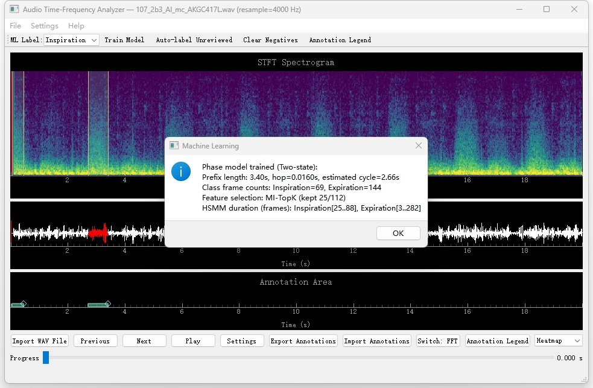
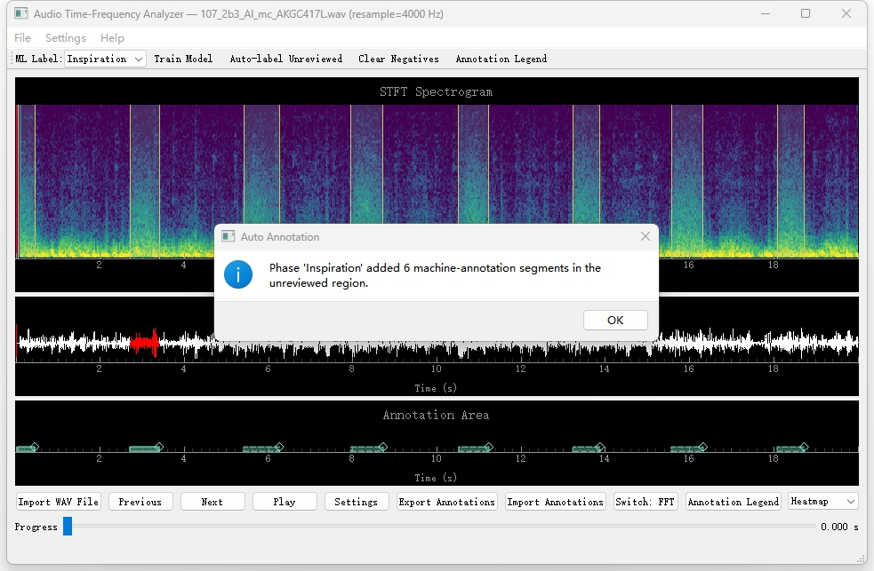
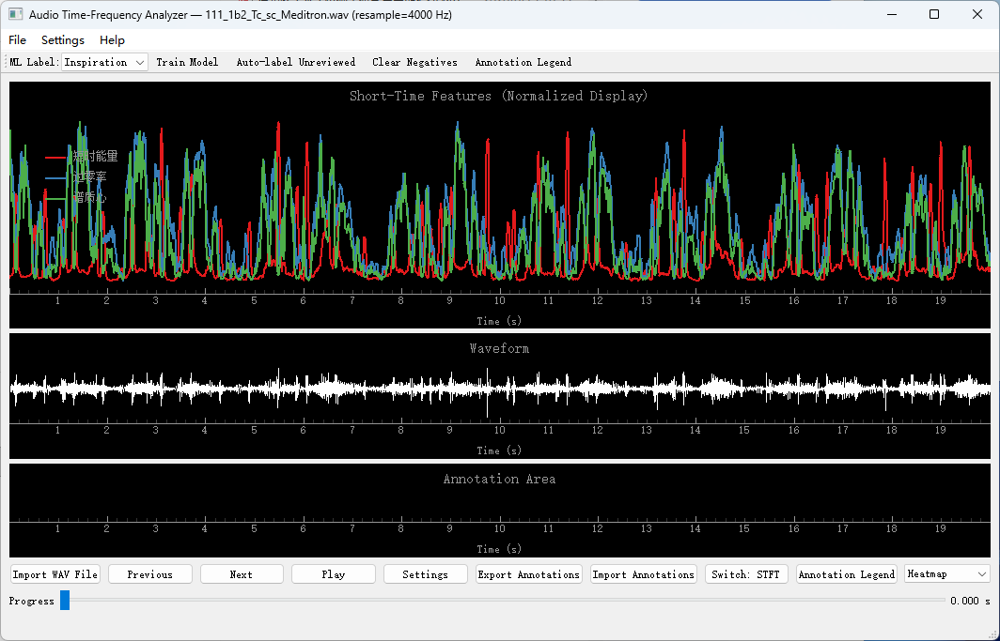
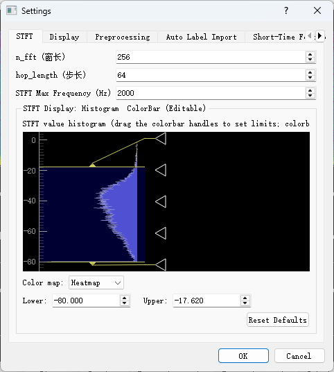
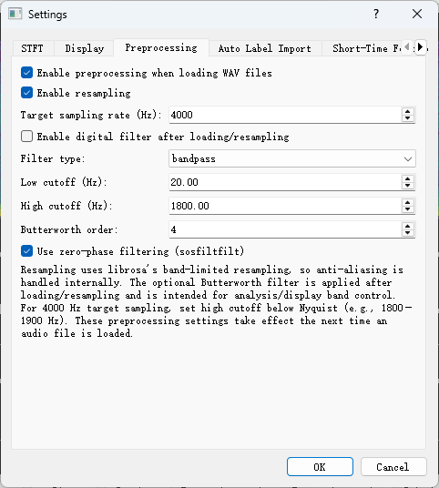
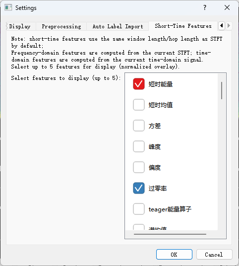
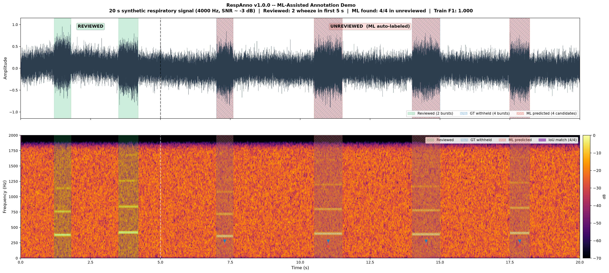
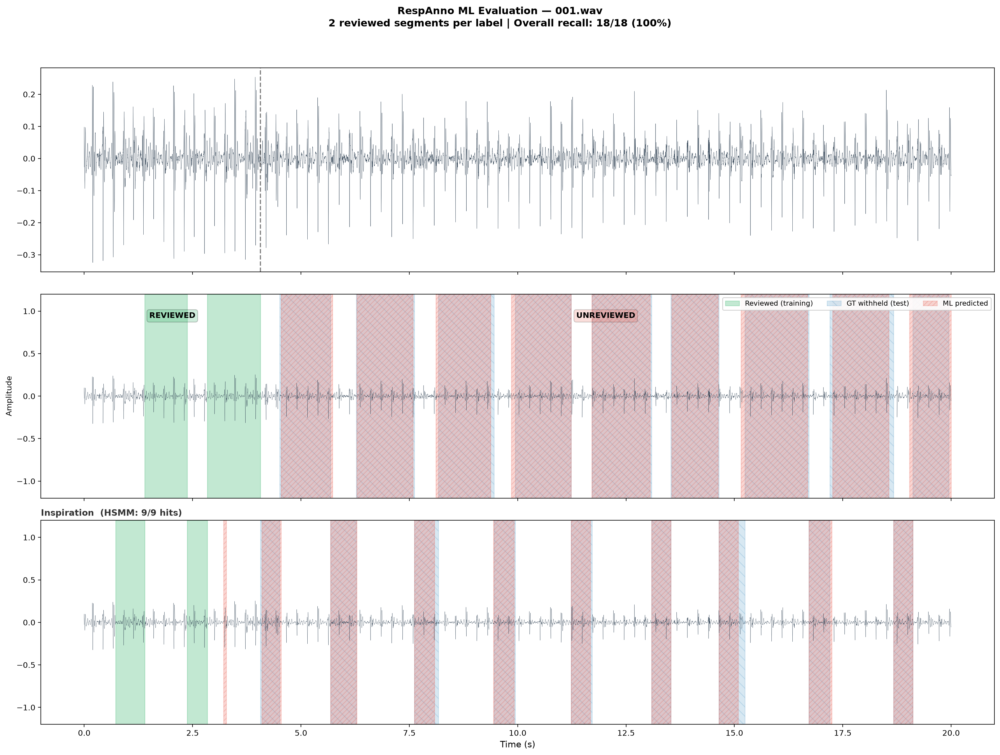

# RespAnno: an interactive respiratory sound annotation tool with machine-assisted candidate labeling

[](https://python.org)
[](./LICENSE)
[](https://github.com/CYsimlie/RespAnno/actions/workflows/ci.yml)

**RespAnno** is an open-source graphical software tool for manual and machine-assisted annotation of respiratory sound recordings. It integrates audio playback, waveform and spectrogram visualization, short-time feature inspection, respiratory phase labeling, abnormal respiratory sound event labeling, LightGBM-based candidate generation, HSMM-based temporal smoothing for respiratory phase candidates, source-aware annotation management, and multi-format annotation import/export.

RespAnno is intended for researchers who build time-aligned respiratory sound datasets or prepare labels for machine-learning experiments. Machine-generated results are treated as editable candidate annotations and require human review before being used as final labels.

---

## Table of contents

- [SoftwareX metadata](#softwarex-metadata)
- [Motivation and significance](#motivation-and-significance)
- [Software description](#software-description)
- [Main features](#main-features)
- [Installation](#installation)
- [Quick start for reviewers](#quick-start-for-reviewers)
- [Typical workflow](#typical-workflow)
- [Input and output formats](#input-and-output-formats)
- [Demo data and example scripts](#demo-data-and-example-scripts)
- [Testing and reproducibility](#testing-and-reproducibility)
- [Repository structure](#repository-structure)
- [Limitations](#limitations)
- [Citation](#citation)
- [License](#license)
- [Contact](#contact)

---

## SoftwareX metadata

### Code metadata

| Nr. | Code metadata description | Metadata |
|-----|---------------------------|----------|
| C1 | Current code version | v1.0.0 |
| C2 | Permanent link to code/repository used for this code version | <https://github.com/CYsimlie/RespAnno> |
| C3 | Permanent link to reproducible capsule/archive | Not applicable |
| C4 | Legal code license | MIT |
| C5 | Code versioning system used | git |
| C6 | Software code languages, tools, and services used | Python, PyQt5, NumPy, SciPy, librosa, scikit-learn, LightGBM, pyqtgraph |
| C7 | Compilation requirements, operating environments and dependencies | See [Installation](#installation) and [Dependencies](#dependencies) |
| C8 | Developer documentation/manual | See [Typical workflow](#typical-workflow), [Testing and reproducibility](#testing-and-reproducibility), and files in `docs/` |
| C9 | Support email for questions | 13145342435@163.com |

### Software metadata

| Nr. | Software metadata description | Metadata |
|-----|------------------------------|----------|
| S1 | Current software version | v1.0.0 |
| S2 | Permanent link to executables of this version | Not applicable. The software is distributed as source code and can be run from the repository. |
| S3 | Permanent link to reproducible capsule/archive | Not applicable |
| S4 | Legal software license | MIT |
| S5 | Computing platforms / operating systems | Windows 10+ tested for GUI use; Linux/macOS supported for source execution and automated tests where dependencies are available |
| S6 | Installation requirements and dependencies | Python 3.10; conda or pip; see [Installation](#installation) |
| S7 | User manual | See [Quick start for reviewers](#quick-start-for-reviewers), [Typical workflow](#typical-workflow), screenshots, and `docs/` |

---

## Motivation and significance

Time-aligned respiratory sound annotation is a prerequisite for developing and evaluating automatic respiratory sound analysis systems. Respiratory recordings may contain respiratory phases, abnormal respiratory sound events, speech, cough, and other non-target events. These events can overlap in time and often require repeated listening and visual inspection.

General-purpose audio editors and annotation tools can support waveform inspection or interval annotation, but respiratory sound dataset construction usually also requires domain-specific label sets, machine-generated candidate review, source/provenance tracking, temporal post-processing for respiratory phases, and conversion to machine-learning targets. RespAnno addresses this practical workflow gap by integrating these steps into a single graphical environment.

The software contribution of RespAnno is therefore primarily workflow-level integration: it connects manual review, model-generated candidate annotations, source-aware revision management, and downstream label export for respiratory sound machine-learning experiments.

---

## Software description

RespAnno consists of a PyQt5-based graphical user interface and a modular Python back end. The graphical interface handles audio navigation, playback, visualization, annotation editing, candidate review, and file operations. The back end provides audio loading, preprocessing, signal visualization utilities, annotation parsing and serialization, LightGBM-based candidate generation, HSMM-based temporal smoothing for respiratory phase candidates, and consistency checks.

### Architecture overview

```text
RespAnno/
├── 1.0.0.py                       # PyQt5 GUI application entry point
├── respanno/                      # Modular Python back end
│   ├── main.py                    # Launcher
│   ├── labels/
│   │   ├── annotation_io.py       # CSV/TXT/JSON annotation I/O
│   │   └── events_importer.py     # WAV-matched event-file import
│   ├── audio/
│   │   └── preprocessing.py       # Resampling and filtering
│   ├── dsp/
│   │   ├── spectrogram.py         # STFT computation and display support
│   │   ├── features.py            # Short-time acoustic features
│   │   └── fft.py                 # FFT magnitude computation
│   ├── ml/
│   │   ├── service.py             # ML pipeline dispatcher
│   │   ├── hsmm.py                # HSMM Viterbi decoding and duration constraints
│   │   ├── phase_model.py         # Respiratory phase model
│   │   ├── classifier.py          # LightGBM event candidate generator
│   │   ├── label_taxonomy.py      # Label routing
│   │   └── frame_labels.py        # Frame-level training label construction
│   └── gui/                       # Reusable GUI components
├── tests/                         # Automated tests
├── docs/                          # Documentation
├── demo_data/                     # Example respiratory sound recordings and labels
├── examples/                      # Example scripts
├── scripts/                       # Functional and reproducibility checks
├── demo_results/                  # Example output figures
└── screenshots/                   # GUI screenshots
```

### Data flow

```text
WAV recording
  │
  ├── audio loading and optional preprocessing
  │       └── resampling / Butterworth filtering
  │
  ├── visualization
  │       ├── waveform
  │       ├── STFT spectrogram
  │       ├── FFT spectrum
  │       └── short-time feature curves
  │
  ├── manual annotation
  │       └── respiratory phases, abnormal sounds, and other events
  │
  ├── machine-assisted candidate generation
  │       ├── LightGBM candidate generation for target labels
  │       ├── negative-sample-driven candidate suppression
  │       └── HSMM temporal smoothing for respiratory phase candidates
  │
  └── source-aware export
          └── CSV / TXT / JSON time-aligned annotations
```

---

## Main features

### Visualization and audio navigation

- WAV loading and audio playback.
- Waveform display for temporal inspection.
- STFT spectrogram display for time-frequency inspection.
- FFT spectrum display for frequency-domain review.
- Short-time acoustic feature curves for local signal characterization.

### Manual annotation

- Time-interval annotation on a shared timeline.
- Built-in respiratory sound label set, including inspiration, expiration, wheeze, crackles, pleural rub, rhonchi/snoring-like sound, stridor, speech, and cough.
- Annotation creation, editing, deletion, and review from the GUI.
- Multi-lane annotation display to reduce visual overlap.
- Configurable label mapping for heterogeneous external annotation files.

### Machine-assisted candidate annotation

- LightGBM-based target-label candidate generation from reviewed positive intervals and negative regions.
- Thresholding, segment merging, minimum-duration filtering, duplicate-candidate removal, and negative-sample-driven suppression.
- HSMM-based temporal smoothing for respiratory phase candidates only.
- Human-in-the-loop review: candidate annotations can be accepted, edited, merged, or rejected.
- Machine-generated outputs are not treated as final ground truth without human review.

### Source-aware annotation management

RespAnno keeps source and revision-related information with exported annotations. Typical source values include:

- `manual`
- `ml`
- `auto_accepted`
- `auto_edited`
- `merged`
- `merged_threshold`

These fields are used to distinguish manually created annotations, machine-generated candidates, and human-revised candidate annotations during dataset construction and downstream label preparation.

---

## Interface


*Figure 1. RespAnno graphical user interface, including file I/O, audio controls, waveform and spectrogram views, annotation tracks, label controls, machine-assisted annotation controls, and import/export functions.*

### Workflow screenshots

| Step | Screenshot |
|------|------------|
| Train a candidate-generation model on reviewed annotations |  |
| Apply the trained model to unreviewed audio regions |  |
| Inspect short-time features over the signal |  |
| Configure preprocessing parameters |  |
| Configure STFT display parameters |  |
| Select feature curves for display |  |

---

## Installation

### Prerequisites

- Python 3.10
- conda or pip
- A working audio backend if audio playback is required

### From source using conda

```bash
git clone https://github.com/CYsimlie/RespAnno.git
cd RespAnno

conda env create -f environment.yml
conda activate respanno

python 1.0.0.py
```

### From source using pip and venv

```bash
git clone https://github.com/CYsimlie/RespAnno.git
cd RespAnno

python -m venv .venv
source .venv/bin/activate      # Windows: .venv\Scripts\activate
pip install -r requirements.txt

python 1.0.0.py
```

### Build a Windows executable

A standalone Windows executable can be built locally with PyInstaller:

```bash
pyinstaller --onefile --windowed --name RespAnno respanno/main.py
```

The packaged executable should be tested on the target Windows system before use.

---

## Dependencies

| Package | Minimum version | Purpose |
|---------|-----------------|---------|
| Python | 3.10 | Runtime |
| PyQt5 | 5.15 | Graphical user interface |
| pyqtgraph | 0.13 | Interactive plotting |
| NumPy | 1.21 | Numerical computation |
| SciPy | 1.7 | Signal processing and FFT |
| librosa | 0.9 | Audio loading and resampling |
| scikit-learn | 1.0 | Preprocessing, feature selection, and metrics |
| LightGBM | 3.3 | Candidate-generation model |
| sounddevice | 0.4 | Audio playback |

---

## Quick start for reviewers

```bash
# 1. Launch RespAnno
python 1.0.0.py

# 2. Import a demo WAV file
# File -> Import Audio -> demo_data/4000Hz/001.wav

# 3. Import example annotations
# File -> Import Annotations -> demo_data/4000Hz/001_example.csv

# 4. Select a target label in the ML toolbar, such as Wheeze or Inspiration

# 5. Click Train Model

# 6. Click Auto-label Unreviewed

# 7. Inspect, accept, edit, or delete the generated candidate annotations

# 8. Export revised annotations
# File -> Export Annotations -> CSV/TXT/JSON
```

---

## Typical workflow

1. **Load audio**: import a WAV recording from the GUI.
2. **Configure preprocessing**: optionally enable resampling and filtering.
3. **Inspect the signal**: review the waveform, spectrogram, FFT spectrum, and short-time feature views.
4. **Create manual annotations**: mark respiratory phases, abnormal respiratory sounds, or other events on the shared timeline.
5. **Train a candidate-generation model**: select a target label and train the model using reviewed positive intervals and available negative regions.
6. **Generate candidate annotations**: apply the trained model to unreviewed parts of the recording.
7. **Review candidates**: accept, edit, merge, or reject machine-generated candidate regions.
8. **Apply phase smoothing when appropriate**: use HSMM-based temporal smoothing for respiratory phase candidates.
9. **Export annotations**: save reviewed annotations in CSV, TXT, or JSON format for archiving or downstream analysis.

### Keyboard shortcuts

| Shortcut | Action |
|----------|--------|
| Ctrl+O | Import WAV file |
| Ctrl+E | Export annotations |
| Ctrl+I | Import annotations |
| Ctrl+P | Open settings dialog |
| Ctrl+Z | Undo last annotation action |
| Space | Play/pause audio |
| Left / Right | Seek backward/forward |
| Up / Down | Previous/next WAV file in directory |
| Delete / Backspace | Delete selected annotation |
| Ctrl+A | Accept selected candidate annotation |
| Ctrl+T | Train model for current label |
| Ctrl+M | Auto-label unreviewed region for current label |
| Enter | Commit span edit |
| Esc | Cancel span edit |
| F1 | About |
| Ctrl+Q | Exit |

---

## Input and output formats

RespAnno supports annotation import and export in CSV, TXT, and JSON formats. Exported annotations preserve the following core fields where applicable:

- recording identifier
- start time
- end time
- label name
- source/provenance field
- revision-related source information

The exported files can be re-imported for roundtrip checking or converted to downstream machine-learning targets, such as frame-level segmentation labels, event-level boundaries, or recording-level summaries.

---

## Demo data and example scripts

The `demo_data/` directory contains example respiratory sound recordings and annotation files for software demonstration and testing. The recordings are excerpted from the [ICBHI 2017 Challenge dataset](https://bhichallenge.github.io/) (Rocha et al., 2018, doi: [10.1007/978-3-030-13969-8_14](https://doi.org/10.1007/978-3-030-13969-8_14)). These are publicly available, de-identified auscultation recordings. **The annotations in the bundled example files have been verified by a physician.**

```text
demo_data/
├── 4000Hz/
│   ├── 001.wav / 002.wav / 003.wav
│   └── 001_example.csv ... 003_example.csv
├── events/
│   └── 001_events.csv ... 003_events.csv
└── OriginFs/
    └── 001_orig.wav ... 003_orig.wav
```

### Example scripts

| Script | Location | Requires GUI | Output | Purpose |
|--------|----------|:------------:|--------|---------|
| `workflow_demo.py` | `examples/` | No | Console | End-to-end workflow on synthetic data |
| `visualize_demo.py` | `examples/` | No | PNG | Synthetic workflow with visualization |
| `real_data_eval.py` | `examples/` | No | Console/PNG | Batch evaluation-style demonstration on demo recordings |
| `ml_demo.py` | `scripts/` | No | Console | Machine-assisted labeling pipeline demonstration |
| `functional_test.py` | `scripts/` | No | Console | Functional verification checks |
| `repro_check.py` | `scripts/` | No | Console | Cross-process reproducibility check |

### Run examples

```bash
python examples/workflow_demo.py
python examples/visualize_demo.py
python examples/real_data_eval.py
python examples/real_data_eval.py --plot
python scripts/ml_demo.py
python scripts/functional_test.py
python scripts/repro_check.py
```

Example outputs are saved in `demo_results/`.



*Figure 2. Example synthetic respiratory signal with reviewed training intervals, ground-truth intervals, and generated candidate annotations.*



*Figure 3. Example output generated by the real-data demonstration script.*

---

## Testing and reproducibility

The test suite covers annotation I/O, label routing, source-aware annotation handling, signal processing, feature extraction, candidate generation, HSMM-based phase smoothing, roundtrip consistency, reproducibility checks, and GUI-related components that can be tested automatically.

Run the full test suite:

```bash
python -m pytest tests -q
```

Run a specific test module:

```bash
python -m pytest tests/test_hsmm_basic.py -v
```

Run reproducibility checks:

```bash
python scripts/repro_check.py
```

### Main test coverage

| Area | Scope |
|------|-------|
| Module imports and APIs | Importability, public interfaces, and GUI/back-end separation |
| Annotation I/O | CSV/TXT/JSON parsing, export, roundtrip, delimiter handling, invalid-row handling |
| Label taxonomy | Respiratory phase, abnormal sound, and other-event routing |
| Signal processing | Filtering, resampling, STFT, FFT, and short-time features |
| Candidate generation | LightGBM training/application, thresholding, segment generation, duplicate handling |
| HSMM phase smoothing | Transition constraints, duration constraints, and Viterbi decoding |
| Source-aware management | Preservation of manual, machine-generated, accepted, edited, and merged source fields |
| End-to-end workflow | Import, visualize, annotate, export, and re-import consistency |
| Reproducibility | Deterministic outputs and cross-process hash consistency where applicable |

These tests validate software functionality, file-format robustness, and computational reproducibility. They do not constitute clinical validation and do not replace independent evaluation of respiratory sound detection or classification models.

---

## Repository structure

```text
RespAnno/
├── 1.0.0.py
├── respanno/
├── tests/
├── docs/
├── demo_data/
├── examples/
├── scripts/
├── screenshots/
├── demo_results/
├── environment.yml
├── requirements.txt
├── LICENSE
└── README.md
```

---

## Limitations

- RespAnno is a research software tool for annotation and candidate review; it is not a clinical diagnostic device.
- Machine-generated annotations are candidate suggestions and require human review.
- The HSMM-based smoothing module is intended for respiratory phase candidates and should not be interpreted as a general-purpose post-processing method for all abnormal sound events.
- GUI behavior has been manually tested on Windows; behavior may vary across operating systems depending on audio and graphical back ends.
- Model performance depends on the recording quality, label quality, reviewed examples, and target label definition.

---

## Citation

If you use RespAnno in academic work, please cite the SoftwareX article once published and cite the archived software release when appropriate.

```text
RespAnno: an interactive respiratory sound annotation tool with machine-assisted candidate labeling.
Version: v1.0.0.
Repository: https://github.com/CYsimlie/RespAnno
Archive: https://doi.org/10.5281/zenodo.20759365
License: MIT
```

---

## Contributing

Contributions are welcome. Please open an issue or pull request on the repository. New functions should include tests where possible, and changes to annotation I/O or machine-assisted labeling behavior should include roundtrip or reproducibility checks.

---

## License

This project is licensed under the MIT License. See [LICENSE](./LICENSE) for details.

---

## Contact

For questions, please contact: 13145342435@163.com

---

*RespAnno supports reproducible, source-aware respiratory sound annotation for dataset construction and machine-learning research.*
