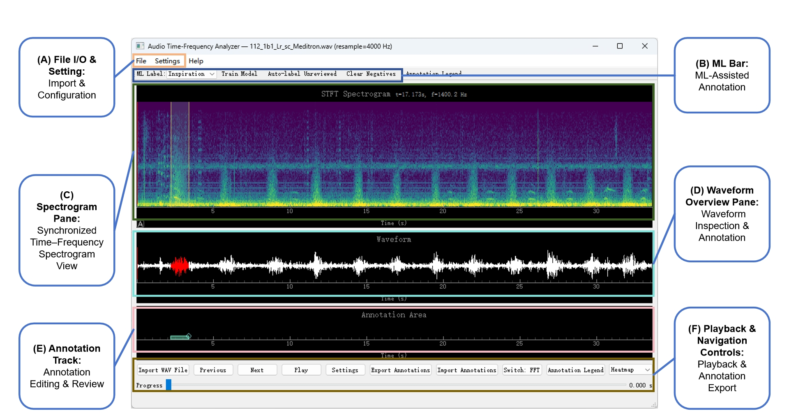

# RespAnno — An Interactive Respiratory Sound Annotation Tool with ML-Assisted Labeling

[](https://python.org)
[](./LICENSE)
[](https://github.com/CYsimlie/RespAnno/actions/workflows/ci.yml)

**RespAnno** is an open-source, interactive annotation tool for respiratory
sound analysis. It provides a complete pipeline from audio preprocessing and
time–frequency visualization through manual annotation and machine-learning-assisted
labeling, targeting researchers and clinicians working with auscultation recordings.

---

## Code Metadata

| Nr. | Code metadata description | Please fill in |
|-----|---------------------------|----------------|
| C1  | Current code version      | v1.0.0         |
| C2  | Permanent link to code / repository used for this code version | https://github.com/CYsimlie/RespAnno |
| C3  | Permanent link to Reproducible Capsule | (to be archived on Zenodo) |
| C4  | Legal Code License        | MIT            |
| C5  | Code versioning system used | git            |
| C6  | Software code languages, tools, and services used | Python, NumPy, SciPy, librosa, scikit-learn, LightGBM |
| C7  | Compilation requirements, operating environments & dependencies | see [§ Dependencies](#dependencies) |
| C8  | Link to developer documentation / manual | see [§ Usage](#usage) |
| C9  | Support email for questions | 13145342435@163.com |

## Software Metadata

| Nr. | Software metadata description | Please fill in |
|-----|------------------------------|----------------|
| S1  | Current software version     | v1.0.0         |
| S2  | Permanent link to executables of this version | (via PyInstaller, see [§ Installation](#installation)) |
| S3  | Permanent link to Reproducible Capsule | (to be archived on Zenodo) |
| S4  | Legal Software License       | MIT            |
| S5  | Computing platforms / Operating Systems | Windows 10+ (GUI tested); Ubuntu/macOS (CI-verified, no manual GUI tests) |
| S6  | Installation requirements & dependencies | conda env or pip, see [§ Installation](#installation) |
| S7  | Link to user manual          | see [§ Usage](#usage) and [§ Workflow](#typical-workflow) |

---

## Motivation and Significance

Auscultation remains the first-line screening tool for respiratory diseases
worldwide, yet manual annotation of breath sound recordings is
labor-intensive, subjective, and poorly reproducible. Existing tools either
target general-purpose audio labeling (e.g., Audacity, ELAN) without
respiratory-domain features, or are closed-source research prototypes that
cannot be extended or audited.

RespAnno addresses this gap by providing:

1. **Domain-specific visualization** — STFT spectrograms, FFT magnitude
   spectra, and 56 short-time features tuned for respiratory signals
   (spectral centroid, roll-off, zero-crossing rate, autocorrelation
   coefficients, etc.).
2. **Hybrid annotation workflow** — manual drag-to-select labeling
   combined with an ML-assisted pipeline that can train frame-level
   LightGBM classifiers on user-reviewed segments and propagate predictions
   to unreviewed regions.
3. **HSMM post-processing for respiratory phases** — a Hidden Semi-Markov
   Model decoder constrains Inspiration/Expiration/Pause transitions with
   learned duration priors, yielding physiologically plausible phase
   boundaries.
4. **Full reproducibility** — all annotations carry a `source` provenance
   tag (manual / ml / auto_accepted / auto_edited / merged), and the
   complete annotation history can be exported in CSV, TXT, or JSON.

The tool is designed to accelerate the creation of high-quality,
reproducible respiratory sound datasets for machine learning research
and clinical studies.

---

## Software Description

### Architecture

RespAnno follows a modular, layered architecture. The computational
back-end (`respanno/`) is a pure Python package with zero GUI dependency;
the graphical front-end (`1.0.0.py`) is a PyQt5 application that imports
and delegates to the back-end modules.

```
SoftwareX/
├── 1.0.0.py                       # PyQt5 GUI application (main entry)
├── respanno/                       # Computational back-end (~5500 lines)
│   ├── main.py                     # CLI launcher
│   ├── labels/
│   │   ├── annotation_io.py        # CSV / TXT / JSON read & write
│   │   └── events_importer.py      # WAV-matched _events file auto-import
│   ├── audio/
│   │   └── preprocessing.py        # Resampling, Butterworth filtering
│   ├── dsp/
│   │   ├── spectrogram.py          # STFT computation & display
│   │   ├── features.py             # 56 short-time features
│   │   └── fft.py                  # FFT magnitude computation
│   ├── ml/
│   │   ├── service.py              # ML pipeline dispatcher (train/apply routing)
│   │   ├── hsmm.py                 # HSMM Viterbi decoder & duration priors
│   │   ├── phase_model.py          # Inspiration/Expiration/Pause training
│   │   ├── classifier.py           # Binary LightGBM event classifier
│   │   ├── label_taxonomy.py       # Label-to-pipeline routing
│   │   └── frame_labels.py         # Frame-level training label builder
│   └── gui/                        # Reusable GUI components
│       ├── dialogs/                 # SettingsDialog, LoopPlayer, AnnotationLabelDialog
│       ├── spans/                  # BoxSpan, SpanLabelItem
│       ├── views/                  # AnnotViewBox, WaveViewBox
│       └── widgets/                # ColorBarWidget, ClickableSlider, ColorCheckDelegate
├── legacy/1.0.0.py                 # Frozen original monolith
├── tests/                          # 535 unit & integration tests
├── docs/                           # Architecture & testing documentation
├── demo_data/                      # ICBHI 2017 benchmark excerpts
└── screenshots/                    # UI overview and workflow screenshots
```

### Data Flow

```
WAV file
  │
  ├─► librosa.load  ──►  [preprocessing: resample + butterworth]  ──►  audio + sr
  │                                                                        │
  ├─► STFT (spectrogram.py)  ──►  colorize  ──►  GUI spectrogram view      │
  │                                                                        │
  ├─► FFT (fft.py)  ──►  GUI spectrum view                                 │
  │                                                                        │
  ├─► features.py  ──►  56-dim feature matrix  ──►  GUI feature plot       │
  │                                                                        │
  └─► manual annotations  ──►  reviewed prefix                             │
            │                                                               │
            ├─►  LightGBM binary classifier (classifier.py)                 │
            │      └─► frame-level 0/1  ──►  segments + dedup             │
            │                                                               │
            └─►  Phase model (phase_model.py)                              │
                   └─► HSMM Viterbi (hsmm.py)  ──►  phase segments         │
```

### Key Features

**Audio Preprocessing:**
- Optional resampling to a target sample rate (default 4000 Hz)
- Configurable Butterworth bandpass / lowpass / highpass filtering with
  zero-phase (filtfilt) option
- Automatic original-sample-rate metadata preservation

**Time–Frequency Visualization:**
- STFT spectrogram with Heatmap and Grayscale color maps
- Configurable FFT size, hop length, and max frequency
- Peak-hold and decimated display for long recordings
- FFT magnitude spectrum view
- 56 short-time features including spectral centroid, roll-off, bandwidth,
  zero-crossing rate, RMS energy, and autocorrelation coefficients

**Manual Annotation:**
- Drag-to-select interval marking on a multi-lane annotation track
- 9 built-in label presets (Wheeze, Crackles, Rhonchi, Stridor,
  Pleural Rub, Speech, Cough, Inspiration, Expiration) with stable colors
- Custom label entry via dialog
- Three-lane layout to prevent overlapping annotations from occluding
  each other

**Annotation Editing:**
- Double-click to enter edit mode; drag handles to resize; Enter to commit
- Right-click context menu for deletion or source-type change
- Undo stack (Ctrl+Z) supporting deletion, boundary editing, and
  source reclassification
- Source provenance tracking (manual / ml / auto_accepted /
  auto_edited / merged)

**ML-Assisted Labeling:**
- Frame-level binary LightGBM classifier with MI-based feature selection
- Automatic probability threshold optimization (F1-max on training set)
- Comprehensive training metrics (Accuracy, Specificity, BAcc, MCC,
  AUROC, AUPRC, Brier score, confusion matrix)
- HSMM post-processing for Inspiration/Expiration/Pause phase labeling
- Negative hard-example mining from user deletions and corrections
- One-click "Clear Negatives" to reset hard negative samples per label
- Real-time negative sample count shown in toolbar tooltip
- Per-label model storage with feature importance ranking

**Import / Export:**
- CSV, TXT, and JSON annotation I/O with automatic delimiter detection
- Optional automatic import of `<wav_base>_events.(csv|txt|json)` files
  on WAV load
- Configurable column mapping and skip-header settings

---

## Interface



*Figure 1. RespAnno graphical user interface, showing (A) File I/O toolbar, (B) Configuration and Help, (C) ML-assisted annotation bar, (D) time–frequency spectrogram pane, (E) waveform overview pane, (F) annotation track with multi-lane layout, and (G) playback and navigation controls.*

### Workflow Screenshots

| Step | Screenshot |
|------|-----------|
| Manual annotation of wheeze |  |
| Model training |  |
| Auto-labeling |  |
| Short-time feature view |  |
| Settings — Preprocessing | .png) |
| Settings — STFT | .png) |
| Settings — Features | .png) |

---

## Installation

### Prerequisites

- Python = 3.10
- conda (recommended) or pip

### From Source

```bash
git clone https://github.com/CYsimlie/RespAnno.git
cd RespAnno

# Using conda (recommended)
conda env create -f environment.yml
conda activate respanno

# Or using pip + venv
python -m venv .venv
source .venv/bin/activate   # Windows: .venv\\Scripts\\activate
pip install -r requirements.txt

# Launch the application
conda run -n respanno python -m respanno.main
```

### Packaged Executable (Windows)

A standalone Windows executable can be built with PyInstaller:

```bash
pyinstaller --onefile --windowed --name RespAnno respanno/main.py
```

### Demo Data

The `demo_data/` directory contains respiratory sound recordings excerpted from the
[ICBHI 2017 Challenge dataset](https://bhichallenge.github.io/)
(Rocha et al., 2018, doi:[10.1007/978-3-030-13969-8_14](https://doi.org/10.1007/978-3-030-13969-8_14)).
These recordings are from publicly available, de-identified auscultation data and are
included solely to demonstrate the annotation workflow. The original dataset spans
920 recordings from 126 subjects across multiple clinical sites; this repository
includes five representative excerpts (resampled to 4000 Hz) with matching
`_events` annotation files for immediate testing.

---

## Usage

### Typical Workflow

1. **Load audio:** File → Import Audio (Ctrl+O) or drag a WAV file.
2. **Configure preprocessing:** Settings (Ctrl+P) → Preprocessing tab.
   Enable resampling (default: 4000 Hz) and/or bandpass filtering as needed.
3. **Inspect the signal:** The top panel shows the STFT spectrogram.
   Use the "Switch: FFT" button to toggle between STFT, FFT spectrum,
   and short-time feature views.
4. **Manually annotate:** Left-click and drag in the bottom annotation
   panel to mark an interval. The Annotation Label dialog opens —
   select a preset label or type a custom one.
5. **Edit annotations:** Double-click a labeled region to resize it.
   Right-click for context options (delete, change source type).
   Ctrl+Z to undo.  Press Delete to remove a selected annotation
   (the deleted region becomes a hard negative sample for training).
6. **Iteratively refine:** Delete incorrect predictions.  Use the ML
   toolbar "Clear Negatives" button to reset if needed, then re-train.
7. **Train an ML model:** Select a label from the ML toolbar dropdown
   (e.g., "Wheeze"), then click "Train Model". The model trains on
   all manually reviewed (annotated) frames.
7. **Auto-label unreviewed data:** Click "Auto-label Unreviewed" to
   propagate the trained model's predictions to the remaining audio.
8. **Export:** File → Export Annotations (Ctrl+E). Choose CSV, TXT,
   or JSON format.

### Keyboard Shortcuts

| Shortcut | Action |
|----------|--------|
| Ctrl+O | Import WAV file |
| Ctrl+E | Export annotations |
| Ctrl+I | Import annotations |
| Ctrl+P | Open settings dialog |
| Ctrl+Z | Undo last annotation action |
| Space | Play / Pause audio |
| Left / Right | Seek backward / forward 1 s |
| Up / Down | Previous / Next WAV file in directory |
| Delete / Backspace | Delete selected annotation |
| Ctrl+A | Accept (approve) selected ML annotation |
| Ctrl+T | Train model for current ML label |
| Ctrl+M | Auto-label unreviewed region for current ML label |
| Enter | Commit span edit |
| Esc | Cancel span edit |
| F1 | About |
| Ctrl+Q | Exit |

---

## Real-Data ML Evaluation

RespAnno comes with a headless evaluation script that tests the ML pipeline
on real respiratory sound recordings with ground-truth annotations.

For each label class, the first `N` ground-truth segments are used as training
data; the model then attempts to annotate the remainder of the recording.
Performance is reported as per-label IoU-based recall.

```bash
# Run on bundled demo data (20 s ICBHI excerpt, Inspiration/Expiration)
python examples/real_data_eval.py

# Run on your own data
python examples/real_data_eval.py recording.wav ground_truth.csv --n_reviewed 2
```

The ground-truth CSV should contain `start,end,label[,source]` columns,
matching the format produced by the GUI annotation export (Ctrl+E).

---

## Dependencies

| Package | Minimum Version | Purpose |
|---------|----------------|---------|
| Python  | 3.10           | Runtime |
| PyQt5   | 5.15           | GUI framework |
| pyqtgraph | 0.13         | Interactive scientific plots |
| NumPy   | 1.21           | Numerical arrays |
| SciPy   | 1.7            | Signal processing, FFT |
| librosa | 0.9            | Audio I/O and resampling |
| scikit-learn | 1.0       | StandardScaler, feature selection, metrics |
| LightGBM | 3.3           | Gradient-boosted tree classifier |
| sounddevice | 0.4         | Audio playback |

---

## Testing

The project has **535 tests** across 24 test modules (534 pass, 1 skip).
All tests pass on every commit.

```bash
# Run the full test suite
conda run -n respanno python -m pytest tests -q

# Run a specific test file
conda run -n respanno python -m pytest tests/test_hsmm_basic.py -v
```

### Test Suite by Module

| Test module | Tests | Scope |
|-------------|-------|-------|
| `test_module_imports` | 82 | Module importability, public APIs, no-GUI-dependency verification |
| `test_label_taxonomy_basic` | 52 | Label-to-pipeline routing (phase, other_event, abnormal_sound) |
| `test_annotation_roundtrip` | 43 | CSV/TXT/JSON I/O: parse, write, roundtrip, delimiter detection |
| `test_gui_widgets_headless` | 37 | PyQt5 headless tests: SettingsDialog, ClickableSlider, ViewBoxes etc. |
| `test_ml_service_basic` | 36 | MLService train/apply/clear dispatch routing |
| `test_preprocessing_basic` | 30 | Butterworth filter, resampling, golden-value validation |
| `test_negatives_basic` | 23 | Hard-negative sample manager lifecycle |
| `test_annotation_quality` | 21 | Annotation invariants, source provenance, overlap ratio |
| `test_spectrogram_basic` | 21 | STFT computation, decimation, color palette, golden values |
| `test_gui_static_integration` | 20 | AST-level GUI—backend coupling verification |
| `test_features_basic` | 19 | 56 short-time features, physical golden-value tests |
| `test_frame_labels_basic` | 19 | Frame-level training label builder with hard negatives |
| `test_hsmm_basic` | 18 | HSMM transition matrices, Viterbi decoding, priors |
| `test_events_importer_basic` | 15 | WAV-matched `_events` file auto-import |
| `test_reproducibility` | 15 | Full-pipeline determinism, cross-process hash consistency |
| `test_classifier_training_basic` | 13 | LightGBM training preconditions, metrics, determinism |
| `test_fft_basic` | 12 | FFT magnitude spectrum, full boundary coverage |
| `test_phase_model_basic` | 12 | 2/3-state HSMM phase model training |
| `test_performance_baseline` | 9 | Throughput and memory benchmarks (report-only) |
| `test_roundtrip_workflow` | 9 | E2E: WAV → preprocess → annotate → export → re-import |
| `test_e2e_ml_pipeline` | 8 | Full ML pipeline on synthetic data |
| `test_phase_apply_basic` | 8 | HSMM inference preconditions and label routing |
| `test_classifier_apply_basic` | 7 | Classifier inference, segment generation, dedup |
| `test_icbhi_compatibility` | 6 | ICBHI 2017 format and naming conventions |

**Disclaimer:** These tests validate functional correctness, file-format robustness,
and computational reproducibility. They do **not** constitute clinical performance
validation or replace independent evaluation of detection models. ML-assisted
annotations are **candidate suggestions** requiring human review.

---

## Project Status

v1.0.0 is the first public release. All components have been extracted from
the original monolith into a modular architecture:

| Component | Status |
|-----------|--------|
| Backend package (`respanno/`) | ✅ Complete |
| GUI entry point (`1.0.0.py`) | ✅ Complete |
| ML pipeline (LightGBM + HSMM) | ✅ Complete |
| Test suite (535 tests, 24 files) | ✅ Complete |
| CI/CD (3 OS × Python 3.10) | ✅ Active |

---

## Related Work

- **Audacity** — General-purpose audio editor with spectrogram view but
  no domain-specific annotation workflow or ML integration.
- **ELAN** — Multimedia annotation tool supporting tiered annotations
  but without respiratory-specific features or ML assistance.
- **LungPass** (Zhang et al., 2024) — Deep learning-based lung sound
  classification; RespAnno can serve as a labeling front-end for such
  models.
- **ICBHI 2017 Challenge Dataset** — Standard benchmark for respiratory
  sound classification; annotations produced by RespAnno follow the
  same event-based labeling paradigm.

---

## Contributing

Contributions are welcome. Please open an issue or pull request on the
repository. All new code should be accompanied by tests.

---

## License

This project is licensed under the MIT License — see the [LICENSE](./LICENSE)
file for details.

---

## Acknowledgments

This work was supported by [funding information to be added].
The authors thank the developers of librosa, LightGBM, and pyqtgraph
for their excellent open-source libraries.

---

*RespAnno — accelerating reproducible respiratory sound research.*
